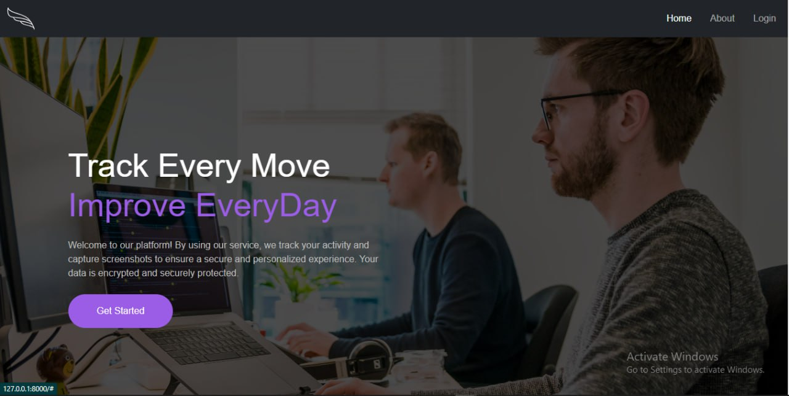
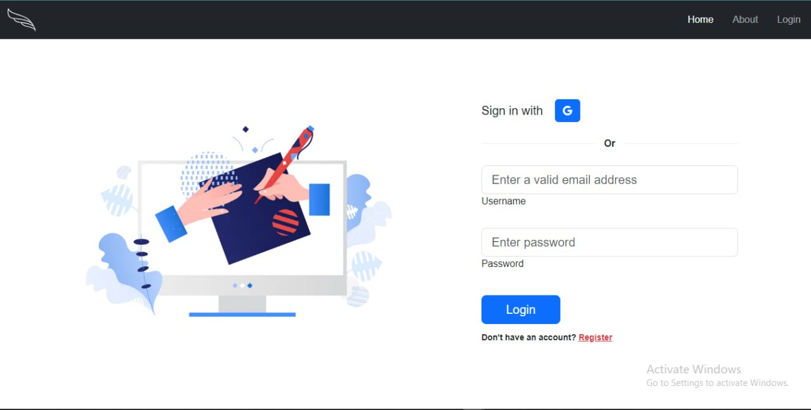
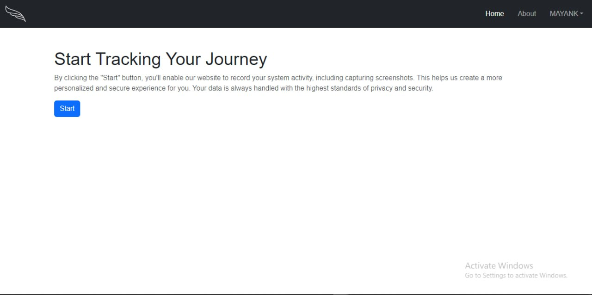
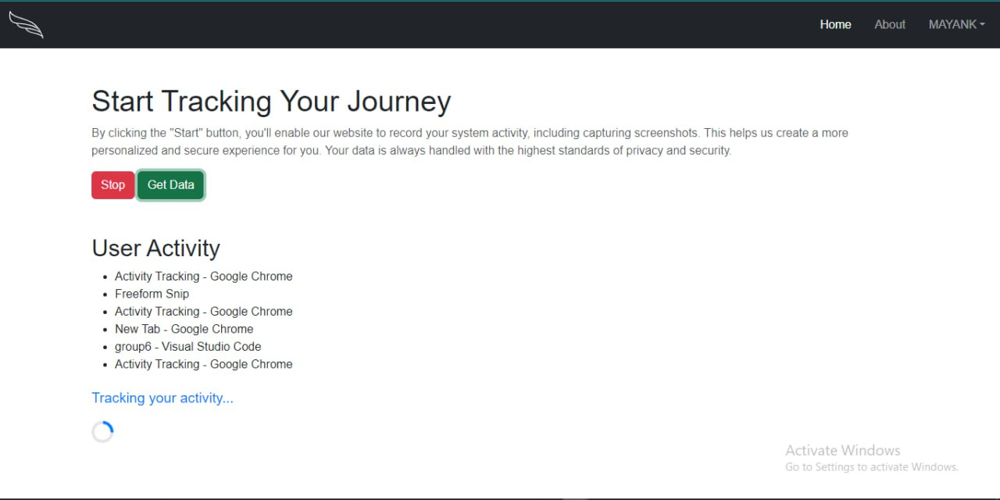
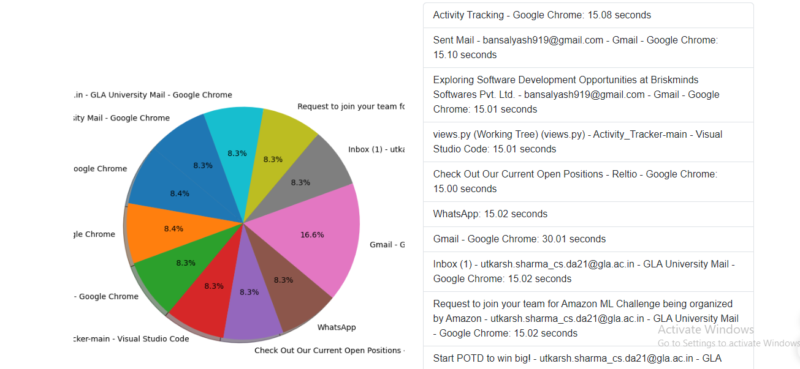

# Activity Tracking App

**Activity Tracking App** is a sophisticated platform designed to monitor the applications you use and capture screenshots of your screen while operating seamlessly in the background.

## Setup Instructions

To get started with the project:

1.  **Download all dependencies** by running:
    
        `pip install -r requirements.txt` 
    
2.  **Navigate to the project directory**:
    
        `cd activitytracking/` 
    
3.  **Start the server**:

        `python manage.py runserver` 
    
5.  **Access the home route** at: [http://127.0.0.1:8000/](http://127.0.0.1:8000/)

## Working Vedio of Application

  

  In this vedio we have just doing some random work/task to create dummy activity for data generation ~ Clone and run our project to access full functionality.

## Features

-   **User Authentication**: Secure user login and registration using JSON Web Tokens (JWT) for authentication, ensuring that user data and sessions are protected.
-   **Activity Tracking**: Monitors which applications are opened and records activity data.
-   **Screenshot Capture**: Takes periodic screenshots of the user's screen to track activity visually.
-   **Data Retrieval**: Provides options to retrieve collected activity data through a dedicated "Get Data" button.
-   **Session Management**: Includes functionality to start and stop tracking sessions as needed.
-   **MongoDB Integration**: Utilizes MongoDB for storing user data, activity logs, and screenshots, offering scalable and flexible data management.
-   **Battery Status Check**: If the battery level is below a specified threshold and the device is not charging, then the applicatoin does not start to save power. 
-   **Data Storage Handling Based on Connectivity**: To store data locally if there is no internet connection and synchronize it with cloud storage when connectivity is restored.
-   **and several more to come for a superior user experience**
## Pages Overview

### Page 1: Intro

This is the introductory page of our website. It features a small motto that encapsulates the essence of our service.

### Page 2: Authentication

From the introduction page, you will be redirected to the authentication page. You need to log in to access the main functionality of the website.

### Page 3: Main Page

On the main page, you will find:

-   A **Start** button to begin tracking activity and taking screenshots.
-   A **Get Data** button to retrieve the collected activity data.
-   A **Stop** button to halt the tracking session.
     

### Page 4: Detailed Data
On this page, you will find out a tables and charts for facilitate better understanding and easier comparison of user activity across various timeframes.

## Technologies Used

-   **HTML**: For structuring the content of the website.
-   **CSS**: For styling the website and enhancing its appearance.
-   **JavaScript**: For adding interactivity to the web pages.
-   **Django**: For the backend framework to handle server-side logic.
-   **Python**: For writing server-side scripts and handling background processes.
- **MongoDB**: For storing user data, activity logs, and screenshots, providing scalable data management.

## Future Updates

-   **Data Visualization**: For provide clear and insightful visualizations of user activity data.

        - Track and log the time spent on different applications.
        - Generate visual comparisons of activity data over different time periods, such as daily, monthly, and yearly trends.
-   **Implementation of Machine Learning Model**: For determine whether the user is genuinely active based on tracked data.

        - Apply a machine learning model to analyze user activity data.
        - Assess and categorize user activity as genuine or idle/inactive.
        - Improve the accuracy of activity tracking by filtering out false positives (e.g., cases where the user is not genuinely engaged).

## Python Libraries Used

-   `asgiref==3.8.1`
-   `bcrypt==4.2.0`
-   `Django==5.1`
-   `djangorestframework==3.15.2`
-   `djangorestframework-simplejwt==5.3.1`
-   `dnspython==2.6.1`
-   `numpy==1.26.4`
-   `psutil==6.0.0`
-   `pyarrow==17.0.0`
-   `PyGetWindow==0.0.9`
-   `PyJWT==2.9.0`
-   `pylance==0.16.1`
-   `pymongo==4.8.0`
-   `PyRect==0.2.0`
-   `python-xlib==0.33`
-   `six==1.16.0`
-   `sqlparse==0.5.1`
-   `typing_extensions==4.12.2`
-   `xlib==0.21`
-   `pywin32`
-   `pillow`
